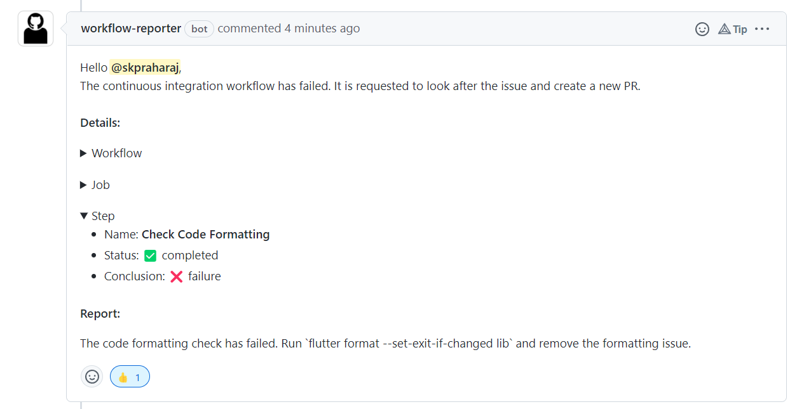

<!-- Project Important -->
<div align="center">

<h1>Workflow Reporter</h1>
</div>

<div align="center">


</div>

<!-- Project Specification -->
<div align="center">

 

 


 


</div>

<!-- Repository Stats -->
<div align="center">
 

 


</div>

</br>

> A GitHub App built with [Probot](https://github.com/probot/probot) that reports failed workflow job actions and notify the pull request creator with custom report message for the failed workflow job step.

## Purpose

Do you have hard time **notifying the pull request creator** about what went wrong with the **workflow job step** and **how to fix it**? If yes, workflow reporter is there for you to automate this process.

Workflow Reporter will automatically tag the pull request creator and notify about the failed workflow job step with your custom report message for the failed job step.

### Demo

<div align="center"> 



</div>

Workflow reporter also provides necessary information about the workflow, job and the step on which the github action failed.

Setup your workflow reporter now!

## Setup

Install the app on GitHub repository from GitHub Marketplace.

Add a `.github/workflow-reporter.yml` file to your repository and then run the bot against it.

If the workflow-reporter file is empty or doesn't exist, the bot will not run.

```yml
# Receive the workflow stats
workflowStat: true

# Receive the workflow job stats
jobStat: true

# Salutation for the user
# Eg. Hello @divshekhar, / Hi @divshekhar,
salutation: Hello

# Custom body message
# This will come after salutation
body: The continuous integration workflow has failed. It is requested to look after the issue and create a new PR.

workflows:
  - name: CI
    jobs:
      - name: build
        steps:
          - name: Install Dependencies
            # custom report message when the check check fails on this step
            report: Check if syntax in the dependency file is correct.

          - name: Check Code Formatting
            # custom report message when the check check fails on this step
            report: The code formatting check has failed. Run `flutter format --set-exit-if-changed lib` and remove the formatting issue.
```

## Development Setup

```sh
# Install dependencies
npm install

# Run the bot
npm start
```

## Contributing

If you have suggestions for how workflow-reporter could be improved, or want to report a bug, open an issue! We'd love all and any contributions.

For more, check out the [Contributing Guide](CONTRIBUTING.md).

## Chat


Join our Discord server to become a part of our developer community!

## Social


## License

[ISC](LICENSE) © 2022 Divyanshu Shekhar.
